# Mini_Project-Advance_Linux_Commands

## Here are the applications of what I have learned from this topic:

## USER MANAGEMENT

### Creating a User

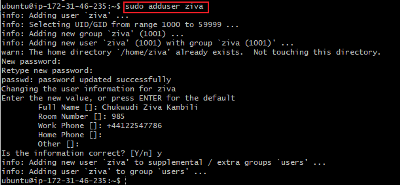

To confirm user existence. `getent passwd [username]`
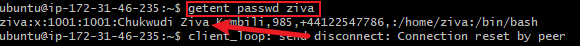

## Granting Administrative Privileges

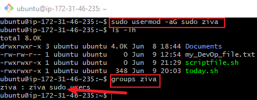

TASK:
1. Log out and log back in as the newly created user
2. Navigate to the `/home/ziva` directory to explore what has been created `TIP:` Use the `cd` command.
## Solution:
1) To Logout
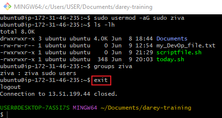

2) To login as the new User
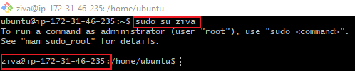

## Modifying user accounts

### To change password
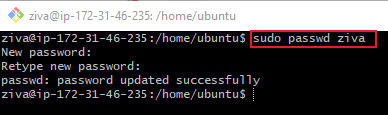

## Creating a Group

- To create developers Group:
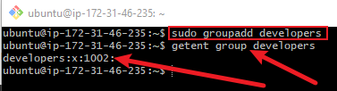

## Adding user to the group
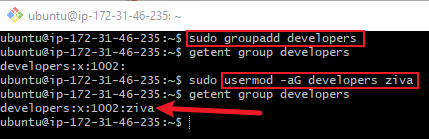

## Verifying Group Memberships
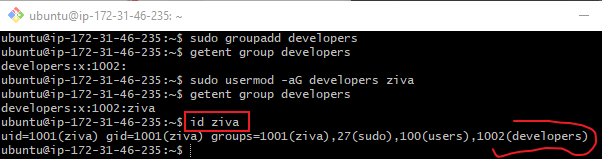

## Deleting a User
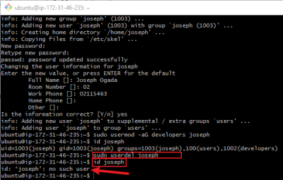

## Ensuring Proper Group Permissions

### File permission commands
To manage file permissions and ownership, Linux provides several commands:

- `chmod` Command:
Example: To create empty file and check the file permission - The output after execution shows that the file is not executable.

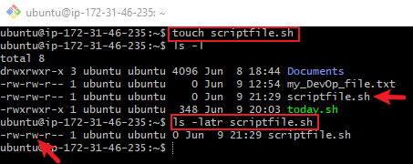

- to make the file executable file using the `chmod` command - look at the screenshot below

- `chown` Command: Allows me to change the ownership of files, directories, or symbolic links to a specified username or group.
Example:

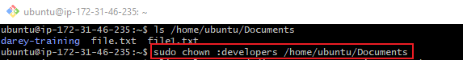

- Grant read and write permissions to the `developers` group for the directory:

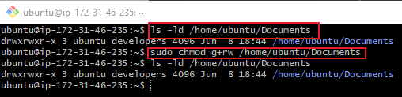

## The above practice demonstrates my practical experience with using Linux commands.