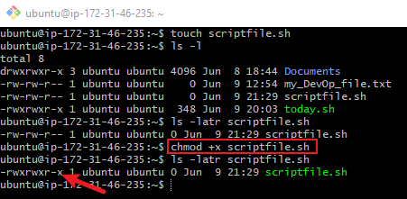
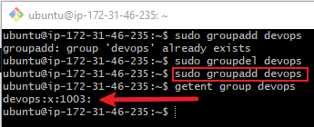
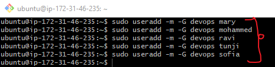
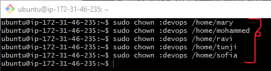
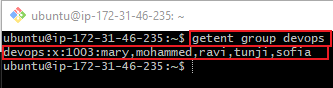
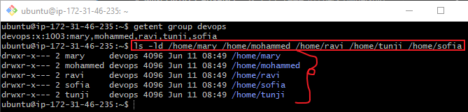

# Mini_Project-Advance_Linux_Commands

## Here are the applications of what I have learned from this topic:

## USER MANAGEMENT

### Creating a User

To confirm user existence. `getent passwd [username]`

## Granting Administrative Privileges

TASK:
1. Log out and log back in as the newly created user
2. Navigate to the `/home/ziva` directory to explore what has been created `TIP:` Use the `cd` command.
## Solution:
1) To Logout

2) To login as the new User

## Modifying user accounts

### To change password

## Creating a Group

- To create developers Group:

## Adding user to the group

## Verifying Group Memberships

## Deleting a User

## Ensuring Proper Group Permissions

### File permission commands
To manage file permissions and ownership, Linux provides several commands:

- `chmod` Command:
Example: To create empty file and check the file permission - The output after execution shows that the file is not executable.

- to make the file executable file using the `chmod` command - look at the screenshot below

- `chown` Command: Allows me to change the ownership of files, directories, or symbolic links to a specified username or group.
Example:

- Grant read and write permissions to the `developers` group for the directory:

## Side Hustle Task 3
- Create a group on the server and name it `devops`
- Create 5 users `["mary", "mohammed", "ravi", "tunji", "sofia"]`, and ensure each user belong to the devops group
- Create a folder for each user in the `/home/` directory. For example `home/mary`
- Ensure that the group ownership of each created folder belongs to `devops`

### Solution:
- TO CREATE `devops` GROUP:

- TO CREATE 5 USERS AND ENSURE THEY ALL BELONG TO `devops` GROUP:

- Create a folder for each user in the /home/ directory
When creating users with the useradd -m command, the home directories (/home/mary, /home/mohammed, etc.) are automatically created.

- Ensure that the group ownership of each created folder belongs to devops

### To check group existence and users in the devops group:

### To check ownership of the home/ directory

## The above practice demonstrates my practical experience with using Linux commands.